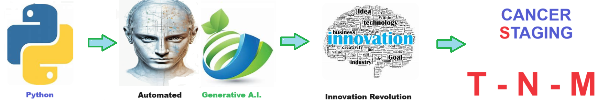

# Cancer Staging - Calculated stage of cancer - Brigham Young T-N-M  Tumor-Nodes-Metastasis
Calculated stage of cancer - Brigham Young T-N-M  Tumor-Nodes-Metastasis

## Cancer Staging

The **Bigham-Young cancer staging methodology** is a system used to classify the severity and progression of cancer, helping in the treatment planning and prognosis assessment. It involves evaluating several factors, including tumor size and extent (T), lymph node involvement (N), and the presence of metastasis (M), similar to the widely used TNM staging system. This methodology provides a structured way to categorize cancer stages from early, localized disease to advanced, metastatic cancer, allowing healthcare providers to develop personalized treatment strategies and predict patient outcomes more accurately.

## The main steps of the Brigham-Young cancer staging methodology are as follows:

1. **Tumor Assessment (T)**: Determine the size and extent of the primary tumor.
2. **Lymph Node Evaluation (N)**: Check for the involvement of regional lymph nodes.
3. **Metastasis Detection (M)**: Assess whether the cancer has spread to distant organs or tissues.
4. **Histopathological Analysis**: Analyze the tumor's cellular characteristics and grade.
5. **Stage Classification**: Combine the gathered data to classify the cancer into a specific stage, guiding treatment decisions and prognosis.

## Getting Started
To get started with the **Cancer Staging** solution repository, follow these steps:
1. Clone the repository to your local machine.
2. Install the required dependencies listed at the top of the notebook.
3. Explore the example code provided in the repository and experiment.
4. Run the notebook and make it your own - **EASY !**
    
## Solution Features
- Easy to understand and use  
- Easily Configurable 
- Quickly start your project with pre-built templates
- Its Fast and Automated

## Notebook Features
- **Self Documenting** - Automatically identifes major steps in notebook 
- **Self Testing** - Unit Testing for each function
- **Easily Configurable** - Easily modify with **config.INI** - keyname value pairs
- **Includes Talking Code** - The code explains itself 
- **Self Logging** - Enhanced python standard logging   
- **Self Debugging** - Enhanced python standard debugging
- **Low Code** - or - No Code  - Most solutions are under 50 lines of code
- **Educational** - Includes educational dialogue and background material
- **Secure** - All the sample solutions are secure and use synthetic data, ensuring they contain no sensitive data or information.
    
## Deliverables or Figures
    
    

## Github    
## https://github.com/JoeEberle/ 

## Email 
## josepheberle@outlook.com 

    

    